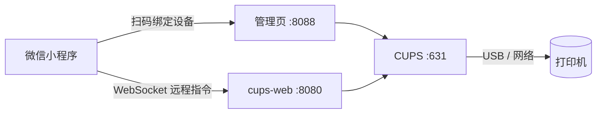

<p align="center">
  
</p>

<h1 align="center">Cloud Printer</h1>

<p align="center">
  把 USB 打印机变成云打印机 · 基于 CUPS 的远程打印服务 · 微信小程序远程打印 · 全文档格式转换
</p>

<p align="center">
  <a href="LICENSE"></a>
  
  
  
</p>

---

## 📖 项目简介

**Cloud Printer** 是一个把一台普通的 Linux 机器（工控机、NAS、树莓派、龙芯等）变成「云打印机」的 Docker 镜像。

在任意 Linux 设备上运行一个 Docker 容器，插入 USB 打印机，即可远程接收打印任务。支持 PDF、图片、Office 文档，兼容 x86_64 / ARM64 / ARMv7 / LoongArch64 架构。

它内置 CUPS 打印服务、文档格式转换（LibreOffice / Ghostscript）与微信小程序对接服务，让你可以通过手机小程序，把微信里的文件、聊天记录直接远程打印到本地连接的 USB / 网络打印机上。

> 本项目以 **MIT 协议** 开源，可自由使用、修改、二次分发。

## 📚 详细教程

完整的 **产品介绍、各 NAS 一键部署向导（群晖 / 威联通 / 飞牛 / 绿联 / 极空间 / iStoreOS 等）、使用教程与问题排查**，请访问详细教程站：

👉 **http://hhnas.eu.org:8586**

---

## 📘 产品简介

### 它是什么

**Cloud Printer（互维云+ 远程打印助手）** 不是一台打印机，而是一个「让旧设备焕发第二春」的打印中枢。它基于 Ubuntu / Armbian 等系统封装了 CUPS（通用 Unix 打印系统）、AirPrint / Bonjour 自动发现与云端接入能力，部署在你已有的硬件上，打印数据全程留在本地，不经过任何第三方中转服务器。你只需在微信小程序里添加设备，就能像在本地一样发起打印。

> 💡 一句话理解：它把「打印机必须连在正在用的电脑上」这件事彻底解耦——打印机连到 NAS / 小主机，全家人 / 全公司的手机和电脑，随时随地都能把文件发过去打印。

### 它能做什么

- 🌐 **远程打印**：人在外面，手机小程序一键把文档 / 图片发到家里的打印机，回来就能取件。
- 👨‍👩‍👧‍👦 **多设备共享**：全家或全公司共用一台打印机，无需每台电脑单独装驱动、配网络。
- 📱 **跨平台发起**：iOS / Android / Windows / macOS 均可发起打印，支持 AirPrint 与原生驱动。
- 🔍 **自动发现**：支持 Bonjour / mDNS，局域网内手机、电脑自动识别到打印机，零配置。
- 🖨️ **多机型支持**：HP / Canon 等 GDI、激光、喷墨机型，USB 直连即插即用，内置常用固件。
- 🔒 **本地优先 · 安全**：Docker 隔离、权限最小化，打印文件不出本地网络，隐私可控。
- 🐧 **全 NAS 兼容**：群晖、威联通、飞牛、绿联、极空间、iStoreOS、Unraid 等一键部署。
- ⚡ **极简部署**：一条安装脚本自动检测环境、拉取镜像、配置网络，新手也能上手。

### 工作原理

打印请求从你的手机出发，经由云端信令，唤醒你本地部署的云打印，通过 USB 把任务送给打印机出纸——全程你只需要点一下「打印」。

1. 📱 **手机 / 电脑** —— 在微信小程序选择文件或图片，点击远程打印。
2. ☁️ **云端** —— 负责设备绑定与信令调度，不存储你的打印内容。
3. 🐳 **本地云打印** —— 你设备上的服务收到任务并转为打印机语言。
4. 🖨️ **USB 打印机** —— 连在 NAS / 小主机上的打印机自动出纸，完成。

### 适用场景

🏠 家庭共享打印 · 🏪 商铺小票 / 凭证 · 🏢 办公室集中打印 · 🎓 校园文印店 · ✈️ 出差临时打印 · 🏥 诊所 / 药房处方 · 📦 仓储面单打印

### 为什么选择

- ✅ **极简部署**：一条命令自动适配，无需手工编排容器网络。
- ✅ **多网络模式**：Bridge / Host 全覆盖，复杂环境也能落地。
- ✅ **全 NAS 兼容**：群晖、威联通、飞牛、绿联、极空间、iStoreOS…通吃。
- ✅ **安全稳定**：Docker 隔离、权限最小化，数据不出本地。
- ✅ **公益免费**：无订阅绑架、无隐藏收费。
- ✅ **持续维护**：固件与镜像持续更新，主流机型即插即用。

## ✨ 功能特性

- 🖨️ **全格式打印**：Word / Excel / PPT / PDF / 图片 / 网页，借助 LibreOffice 与 Ghostscript 自动转换
- 📱 **微信小程序远程打印**：扫码绑定设备，手机随时发起打印
- 🔌 **自动加载固件**：HP LaserJet 1020/1005/1018/P1005/P1006/P1007/P1008/P1505 等无固件打印机上电自动灌固件
- 🌐 **多架构支持**：amd64 / arm64 / arm/v7 / loong64
- 🧰 **可视化管理页**：设备管理、打印机增删、WiFi 配网、日志查看一页搞定
- 🔍 **局域网发现**：基于 Avahi / mDNS，自动被发现

## 🏗️ 架构



| 端口 | 服务 | 说明 |
| --- | --- | --- |
| 631 | CUPS | 打印服务 Web 管理界面 |
| 8080 | cups-web | 小程序对接 / 打印网关 |
| 8088 | 管理页 | 本机设备管理页（本项目的品牌界面） |
| 22 | SSH | 容器 SSH（默认 root / admin123，请及时修改） |
| 5353/udp | mDNS | 局域网打印机发现 |

---

## 🚀 快速开始（docker-compose，推荐）

镜像由 GitHub Actions 自动构建并发布到 `ghcr.io/tzi-shue/cloud-printer`，**无需克隆源码、无需本地构建**，直接拉取运行：

```bash
# 1. 安装 Docker
curl -fsSL https://get.docker.com | sh
sudo usermod -aG docker $USER

# 2. 下载 docker-compose.yml 并启动（自动从 ghcr.io 拉取镜像）
#    可先 git clone 获取编排文件，或直接复制本仓库的 docker-compose.yml
docker-compose up -d

# 3. 验证
docker exec cloud-printer lpstat -r
# 输出 scheduler is running 即表示正常

# 4. 查看设备二维码（用于小程序绑定）
docker-compose exec cloud-printer /opt/websocket_printer/generate_qrcode.sh
```

打开浏览器访问：

- 设备管理页：<http://localhost:8088>
- CUPS 管理：<http://localhost:631>（用户 `root`，密码见 `CUPS_ADMIN_PASSWORD`）
- cups-web：<http://localhost:8080>（用户 `admin` / `admin`）

## 🐳 从 GitHub 镜像库（ghcr.io）拉取

无需克隆源码，直接拉取已构建好的多架构镜像：

```bash
docker pull ghcr.io/tzi-shue/cloud-printer:latest
docker run -d \
  --name cloud-printer \
  --network host \
  --privileged \
  -e TZ=Asia/Shanghai \
  -e CUPS_ADMIN_PASSWORD=你的密码 \
  -v cloud-printer-cups:/etc/cups \
  -v cloud-printer-logs:/var/log/printer-client \
  -v cloud-printer-device-id:/etc/printer-device-id-vol \
  -v cloud-printer-openid:/etc/printer-openid \
  -v cloud-printer-tailscale:/var/lib/tailscale \
  -v cloud-printer-tailscaled:/etc/default/tailscaled \
  -v cloud-printer-websocket:/opt/websocket_printer \
  -v /dev/bus/usb:/dev/bus/usb \
  --restart always \
  ghcr.io/tzi-shue/cloud-printer:latest
```

> 镜像由 GitHub Actions 在打 tag（如 `v1.2.5-14`）或发布 Release 时自动构建并推送到
> `ghcr.io/tzi-shue/cloud-printer`，支持 amd64 / arm64 / arm/v7 / loong64 多架构。

## 💡 一键脚本部署（物理机 / Linux）

如果你是在 Ubuntu / Armbian / 海纳斯OS / Debian 等 Linux 裸机或虚拟机上部署（非 NAS 套件），可使用官方一键安装脚本，自动检测系统、安装 Docker、拉取镜像并部署：

```bash
# 推荐首选（功能最强，自动检测网络环境）
bash -c "$(curl -fsSL http://hhnas.eu.org:8586/install.sh)"

# 备用方案 A · 轻便安装
bash -c "$(curl -fsSL http://hhnas.eu.org:8586/install_lite.sh)"

# 备用方案 B · 稳定兼容版（老旧内核 / 特殊 ARM 架构）
bash -c "$(curl -fsSL http://hhnas.eu.org:8586/install_old.sh)"
```

执行脚本后按交互提示选择网络模式（推荐双网络模式），无需手动编写 docker run / docker-compose。各 NAS 的图形化部署向导见 👉 http://hhnas.eu.org:8586

## 📱 微信小程序绑定

1. 微信搜索并打开配套打印小程序「互维云+」
2. 在小程序中点击「绑定设备」
3. 扫描管理页（:8088）或容器日志中显示的 **设备二维码**（也可手动输入设备 ID）
4. 绑定成功后即可远程选择文件并打印

## ➕ 添加打印机

### Web 管理页（推荐）

1. 将 USB 打印机插入设备
2. 访问 `http://设备IP:8088`
3. 点击「自动检测打印机」，选择后自动安装驱动

### CUPS Web 界面

访问 `http://设备IP:631`，用户名 `root`，密码为 `CUPS_ADMIN_PASSWORD`。

### 命令行

```bash
# 查看可用设备
docker exec cloud-printer lpinfo -v

# 添加打印机
docker exec cloud-printer lpadmin -p MyPrinter -v usb://... -m <driver> -E

# 打印测试
docker exec cloud-printer lp -d MyPrinter /usr/share/cups/data/testprint
```

---

## 📘 使用教程

「互维云+ 远程打印助手」基于 **CUPS** 的微信小程序云打印服务。你平时主要和几个入口打交道：① 手机上的微信小程序「互维云+」（远程发起打印）② 电脑浏览器里的**管理页面**（`:8088`，添加 / 配置打印机）③ **CUPS-WEB 页面**（`:8080`，文件上传与高级设置）。下面按真实使用顺序讲清楚每一步。

> ✅ **开始前请确认**：已部署并运行（容器处于 Up 状态）；打印机已用 USB 或局域网接到设备，开机、装纸；手机微信已打开小程序「互维云+」；知道设备的局域网 IP。

### 三个操作入口

- 📱 **微信小程序「互维云+」**：手机远程打印主入口——微信打印 / 手机打印 / 文本打印 / 微信图片 / 微信文件，内置文档库。
- 🖨️ **管理页面 · :8088**：浏览器访问 `http://IP:8088`，**添加 / 配置打印机**的主入口：USB 自动发现、填 IPP 地址、选驱动、设默认，无需登录 CUPS 后台。
- 🖥️ **CUPS-WEB 页面 · :8080**：浏览器访问 `http://IP:8080`，默认账号 admin / admin，拖拽上传文件、参数设置、多用户管理与打印记录。

### 第一步 · 绑定设备（关键）

1. **获取设备 ID / 绑定二维码**：浏览器访问 `http://IP:8088`，主页会显示**设备 ID** 和**绑定二维码**（一键脚本安装完成后终端通常也会直接显示）。
2. **小程序里添加设备**：打开「互维云+」→「打印机管理 / 添加设备」，可通过**云 ID 添加**（输入设备 ID）或**扫码绑定**（扫显示的二维码）。
3. **确认绑定成功**：绑定后设备出现在列表并标注在线；点击设备可进入详情页。这一步做对，后面才能选到打印机。

### 第二步 · 添加并配置打印机

- **方式一 · 管理页面添加（推荐，最简单）**：
  - 浏览器访问 `http://IP:8088`，打开**管理页面**
  - 进入「添加打印机」：**USB 打印机**通常会**自动发现**，列表里直接选中即可；**网络打印机**选「网络打印机 / IPP」并填 `ipp://打印机IP/ipp`（是打印机自身的 IP）
  - 给打印机起个易记的名字（如「客厅HP」），没有对应型号就选 **IPP Everywhere** / 通用驱动
  - 设为**默认打印机**并保存，添加即完成
  - 点**打印测试页**验证，能出纸即配置正确
- **方式二 · 小程序添加**：绑定设备后，管理页面里已添加的打印机会**自动同步**到小程序，无需重复配置；也可在「打印机管理」里手动添加并配置驱动。
- ℹ️ 早期版本需登录 CUPS 后台（`:631`，root / admin123）手动添加；现版本已内置管理页面（`:8088`），**日常添加打印机无需再登录 CUPS 后台**。CUPS 后台仍保留，仅在需要高级手动配置时访问。

### 第三步 · 手机远程打印

1. 在小程序首页选入口： **微信打印**（从聊天记录选图片 / 文档）、**手机打印**（从相册 / 文件）、**文本打印**、**微信图片**、**微信文件**。
2. 选好要打印的内容，选择目标打印机，设置份数、色彩（彩色 / 灰度）、纸张尺寸、横向 / 纵向等，提交后自动接收并打印。
3. 打印历史（含份数、时间）可在小程序查看，方便回溯。

### 第四步 · 网页管理后台（电脑端）

- 访问 `http://IP:8080`，默认账号 / 密码均为 `admin`
- **拖拽上传** Word / Excel / PPT / PDF / 图片，自动转 PDF 并预览
- 自定义 **黑白 / 彩色、双面、份数、纸张尺寸** 等参数
- 支持**多用户账号管理**、打印记录查询、自动清理数据

### 支持的文件与格式

| 格式 | 处理方式 |
| --- | --- |
| 文档 | PDF / Word / Excel / PPT / TXT |
| 图片 | JPG / PNG 等常见格式 |
| 文本 | 直接粘贴文本打印 |
| 微信文件 | 聊天记录里的图片 / 文档直接打印 |

### 共享给家人 / 同事

- **CUPS-WEB 页面**：在管理后台创建多个用户账号，各自登录即可共用同一台打印机。
- **小程序**：在「管理」→ 点击要分享的设备下方的「分享」按钮，将小程序发给对方，对方在小程序里「添加」即可。

---

## 🌐 网络模式（部署向导）

容器支持多种网络模式，适配不同 NAS / 路由器环境：

| 模式 | 独立 IP | 手机 AirPrint 发现 | 宿主机访问 | 端口冲突 |
| --- | --- | --- | --- | --- |
| Bridge | ❌ | ❌ 受限 | ✅ 端口映射 | ✅ 无 |
| Host | △ 共享 | ✅ | ✅ | ✗ 有 |
| 纯 macvlan | ✅ | ✅ | ✗ 不支持 | ✅ 无 |

> 💡 **推荐Host网络模式**
> 各 NAS 的图形化网络配置向导与完整命令见 👉 http://hhnas.eu.org:8586

---

## 🖨️ HP 打印机说明

### 需要固件上传的型号

以下型号没有内置固件存储，每次断电后需要主机重新上传固件：

| 驱动 | 型号 | 固件 |
| --- | --- | --- |
| foo2zjs | 1000 / 1005 / 1018 / 1020 | sihp10xx.dl |
| foo2xqx | P1005 / P1006 / P1007 / P1008 / P1505 | sihpP10xx.dl |

### 固件处理机制

系统通过两层机制保证固件加载：

- **hp-firmware CUPS 后端**：每次打印前自动上传固件，再转发任务到 USB 后端
- **fix-foo2zjs-printer.sh**：独立修复脚本，处理 URI 变化、固件缺失、深度休眠唤醒

### 长时间待机唤醒

HP 上述型号长时间不用会进入深度休眠，USB 停止响应。系统自动执行唤醒流程：

1. 向 USB 设备写入探测数据，检测是否响应
2. 扫描所有 `/dev/usb/lp*` 尝试唤醒
3. 通过 `cupsenable` 恢复 stopped 状态的 CUPS 队列
4. 唤醒成功后上传固件，等待初始化完成
5. 验证 CUPS 状态变为 idle

手动触发修复：

```bash
docker exec cloud-printer bash /opt/websocket_printer/fix-foo2zjs-printer.sh fix
```

## 🖥️ Web 管理页

端口 8088，功能包括：

- 自动检测 USB 打印机并推荐驱动
- 添加 / 删除 / 修改打印机
- 更换驱动、查看状态和队列
- 在线更新各组件
- HP 打印机固件手动上传
- cups-web 安装与管理

## 🔄 在线更新

无需重建镜像，直接更新容器内组件：

```bash
docker exec -it cloud-printer bash /opt/websocket_printer/update.sh
```

可选更新项：主程序、Web 管理页、CUPS 配置、Supervisor 配置、HP 修复脚本，或全部更新。更新前自动备份，失败自动恢复。

## ⚙️ 环境变量

| 变量 | 默认值 | 说明 |
| --- | --- | --- |
| `TZ` | `Asia/Shanghai` | 时区 |
| `CUPS_ADMIN_PASSWORD` | `admin123` | CUPS 管理员密码（**请务必修改**） |
| `LIBREOFFICE_TIMEOUT` | `120` | LibreOffice 转换超时（秒） |

## 💾 数据持久化

| 卷名 | 路径 | 内容 |
| --- | --- | --- |
| cloud-printer-cups | /etc/cups | CUPS 打印机配置 |
| cloud-printer-logs | /var/log/printer-client | 运行日志 |
| cloud-printer-device-id | /etc/printer-device-id-vol | 设备标识 |
| cloud-printer-openid | /etc/printer-openid | 微信小程序 openid |
| cloud-printer-tailscale | /var/lib/tailscale | Tailscale 异地组网状态 |
| cloud-printer-tailscaled | /etc/default/tailscaled | Tailscale 配置 |
| cloud-printer-websocket | /opt/websocket_printer | WebSocket 打印组件 |

容器还挂载了宿主机的 `/dev/bus/usb` 用于访问 USB 打印机。

## 📂 目录结构

```
cloud-printer/
├── Dockerfile              # 镜像构建（已含 OCI 元数据）
├── docker-compose.yml      # 一键编排（镜像指向 ghcr.io）
├── Makefile                # 常用运维命令（make build/up/logs/qr ...）
├── entrypoint.sh           # 容器启动入口
├── app/                    # PHP 客户端与管理页（printer_web_admin.php 为本项目品牌界面）
│   ├── printer_client.php             互维云+ 客户端主程序
│   ├── printer_web_admin.php          Web 管理页（已加项目 Logo 与品牌）
│   ├── printer-client.service         systemd 服务文件
│   ├── fix-foo2zjs-printer.sh         HP 打印机固件修复脚本
│   ├── update.sh                      在线更新脚本
│   └── generate_qrcode.sh             设备二维码生成
├── config/                 # CUPS 与 supervisord 配置
├── Chinese_Language/       # CUPS 界面中文化
├── cups-web/               # cups-web 预编译二进制（Git LFS 管理）
├── docs/                   # 赞赏二维码（微信 / 支付宝）
├── assets/                 # 项目 Logo（logo.png / logo.svg）
├── .github/workflows/      # 自动构建并推送 ghcr.io 的工作流
└── LICENSE                 # MIT 协议
```

## 🛠️ Make 命令

```
make up            启动容器（自动拉取 ghcr 镜像）
make down          停止容器
make restart       重启
make logs          实时日志
make shell         进入容器
make status        查看状态
make qr            设备二维码
make device-id     设备 ID
make printers      打印机列表
make queue         打印队列
make cancel-all    取消全部任务
make test          测试打印
make backup        备份 CUPS 配置
make restore       恢复配置
make clean         清理临时文件
make info          系统信息
```

## 🔧 本地 / CI 构建

本地从源码构建（需先拉取 LFS 文件）：

```bash
git lfs install && git lfs pull
docker build -t ghcr.io/tzi-shue/cloud-printer:latest .
```

CI 自动构建：推送 `v*` tag 或发布 Release 即触发，镜像自动推送至 `ghcr.io`。
详见 [.github/workflows/docker-image.yml](.github/workflows/docker-image.yml)。

## 📜 日志

```bash
# 客户端日志
docker exec cloud-printer tail -f /var/log/printer-client/client_$(date +%Y-%m-%d).log

# CUPS 日志
docker exec cloud-printer tail -f /var/log/cups/error_log

# 容器输出
docker logs -f cloud-printer
```

---

## ❓ 问题排查

### 快速自检流程

1. **看容器是否在跑**：`docker ps | grep cloud-printer`，确认 STATUS 为 Up。
2. **看日志报什么错**：`docker logs --tail 100 cloud-printer`，根据错误关键词搜索下方常见报错。
3. **看网络和端口**：确认防火墙放行 631/tcp、8080/tcp、5353/udp，且容器 IP/端口可连通。
4. **看打印机是否被识别**：`lsusb` 或 `usb-devices`，确认 USB 打印机在宿主机已列出。

### 常用排查命令

| 检查项 | 命令 |
| --- | --- |
| 容器是否运行 | `docker ps \| grep cloud-printer` |
| 查看最近 100 行日志 | `docker logs --tail 100 cloud-printer` |
| 进入容器内部 | `docker exec -it cloud-printer /bin/bash` |
| 重启容器 | `docker restart cloud-printer` |
| 查看容器 IP | `docker inspect -f '{{range .NetworkSettings.Networks}}{{.IPAddress}}{{end}}' cloud-printer` |
| 测试端口连通性 | `curl -v http://localhost:631` |
| 列出 USB 设备 | `lsusb` |
| 查看 CUPS 已识别打印机 | `docker exec cloud-printer lpstat -v` |
| 打印测试页 | `docker exec cloud-printer lp -d 打印机名 /usr/share/cups/data/testprint.pdf` |

### 常见报错处理

- **容器启动后立即退出**：执行 `docker logs cloud-printer` 查看错误；常见原因：CUPS 管理员密码为空、macvlan 网卡错误、端口被占用。
- **局域网搜索不到打印机**：Host / 双网络模式下 mDNS 依赖 5353/udp；Bridge 模式默认不支持 Bonjour 跨网段发现，建议改用双网络或 Host 模式。
- **打印任务卡住 / 显示暂停**：在 CUPS 管理页 `http://宿主机IP:631` 找到打印机，点击「Resume Job」；或执行 `docker exec cloud-printer cupsenable 打印机名`。
- **小程序提示设备离线**：检查是否能访问互联网（用于云端信令），同时检查容器日志中是否有 WebSocket 连接成功提示。

### 常见问题（FAQ）

**打印机无法识别？**
确认容器以 `privileged: true` 运行，检查 USB 连接：

```bash
docker exec cloud-printer lsusb
docker exec cloud-printer lpinfo -v
```

**打印出来是空白 / 乱码？**
多半是 CUPS 驱动选错。回到 `IP:631` 重新 Add Printer，型号选 IPP Everywhere / General，再 Print Test Page 验证。

**HP 打印机打印空白页？**
固件未加载，手动上传：

```bash
docker exec cloud-printer bash /opt/websocket_printer/fix-foo2zjs-printer.sh firmware-only
```

**容器重启后打印机不工作？**
HP foo2zjs 系列需要重新上传固件，系统启动约 20 秒后自动执行。如仍不工作：

```bash
docker exec cloud-printer bash /opt/websocket_printer/fix-foo2zjs-printer.sh fix
```

**设置双面却打出单面？**
部分 Windows 客户端（PrinterClient）版本有此已知问题；建议改用 CUPS 后台或网页管理后台（:8080）勾选双面后提交，检查是否支持双面打印。

**不在同一 WiFi 能打印吗？**
可以。在线后任务经云端下发，手机只要有网络就能远程提交。

**LibreOffice 转换超时？**
增大超时时间：

```yaml
environment:
  - LIBREOFFICE_TIMEOUT=300
```

**修改 CUPS 密码？**
编辑 `docker-compose.yml` 中的 `CUPS_ADMIN_PASSWORD`，然后：

```bash
docker-compose down && docker-compose up -d
```

> 仍无法解决？请准备：容器日志前 50 行、宿主机系统与版本、网络模式、打印机型号与连接方式，前往 👉 http://hhnas.eu.org:8586 的交流群获取技术支持。

## 🧩 技术栈

CUPS 2.3+ · PHP 7.4 · Supervisor · foo2zjs / foo2xqx · Ghostscript · ImageMagick · poppler-utils · LibreOffice · cups-web · Avahi · Ubuntu 20.04

## 📄 许可证

本项目基于 [MIT License](LICENSE) 开源。

## ⚠️ 免责声明

- 镜像构建过程中会从第三方源（如 `quirinux.org`、OpenPrinting 等）下载打印机固件，请遵守对应许可证。
- 默认账户密码较弱，生产环境请务必修改 `CUPS_ADMIN_PASSWORD` 与 SSH 密码。
- 本项目与任何打印机厂商无隶属关系。

## ☕ 支持本项目

如果这个项目帮到了你，欢迎请作者喝杯咖啡，你的支持是持续维护和改进的动力 ☕

| 微信支付 | 支付宝 |
|:---:|:---:|
|  |  |

## 赞赏后凭截图领取打印机定时清理授权码

赞助时请备注 GitHub ID，将在下方列出感谢。

### 感谢名单

| 赞助人 | 金额 | 日期 |
| --- | --- | --- |
| *虚位以待* | | |
